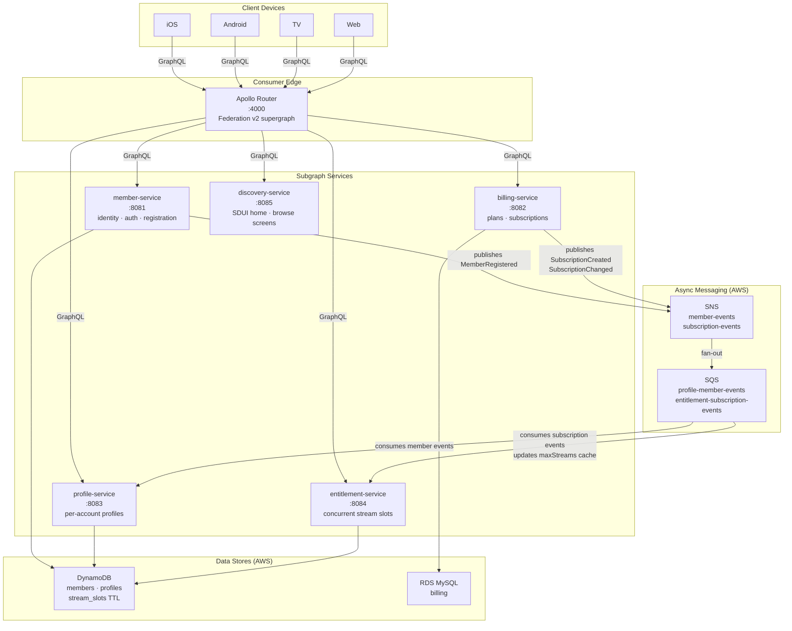

# Streaming Member API

A Consumer Edge GraphQL supergraph that models the member management layer of a streaming platform. Five TypeScript/Node.js subgraphs are composed into a unified API by Apollo Router using Federation v2. Development is schema-first: GraphQL SDL files are the source of truth, and TypeSpec covers the REST auth and async event contracts.

## Architecture



Two API paradigms are implemented:

- **Client-driven** — standard GraphQL queries; clients declare what fields they need
- **Server-Driven UI (SDUI)** — `homeScreen` / `browseScreen` queries return a `DiscoveryComponent` union; the client renders whatever component tree the server returns

## Tech Stack

| Layer | Technology |
|---|---|
| API gateway | Apollo Router v1.55 (Federation v2) |
| Subgraph runtime | Node.js 20 + TypeScript + Apollo Server 4 |
| member / profile / entitlement | DynamoDB (PAY_PER_REQUEST) |
| billing | RDS MySQL 8.4 (db.t3.micro) |
| async events | SNS → SQS (fan-out) |
| stream slot TTL | DynamoDB TTL attribute |
| schema contracts | GraphQL SDL + TypeSpec |
| infra provisioning | CloudFormation (dev) + Terraform (prod) |

## Prerequisites

- Docker Desktop (or Docker Engine + Compose plugin)
- [Rover CLI](https://www.apollographql.com/docs/rover/getting-started) — Apollo's schema composition tool
- AWS CLI configured with credentials that have access to DynamoDB, RDS, SNS, SQS
- Node.js 20+ (for TypeSpec spec validation only)

**Install Rover:**
```bash
curl -sSL https://rover.apollo.dev/nix/latest | sh
```

## First-time Setup

**1. Provision AWS dev resources** (one-time, idempotent):
```bash
make aws-setup
```

This deploys `scripts/dev-resources.yaml` (CloudFormation) which creates:
- DynamoDB tables: `members`, `profiles`, `stream_slots` (with TTL)
- SNS topics: `member-events`, `subscription-events`
- SQS queues: `profile-member-events`, `entitlement-subscription-events` (with SNS subscriptions)
- RDS MySQL: `billing-dev` (db.t3.micro, publicly accessible for dev)

**2. Create a `.env` file** from the CloudFormation outputs:
```bash
# AWS credentials
AWS_REGION=us-east-1
AWS_ACCESS_KEY_ID=...
AWS_SECRET_ACCESS_KEY=...

# member-service
JWT_SECRET=...
MEMBER_EVENTS_TOPIC_ARN=...  # output from aws-setup

# billing-service
MYSQL_HOST=...               # BillingDBEndpoint output from aws-setup
MYSQL_USER=billing
MYSQL_PASSWORD=...
MYSQL_DATABASE=billing
SUBSCRIPTION_EVENTS_TOPIC_ARN=...

# profile-service
PROFILE_MEMBER_EVENTS_QUEUE_URL=...

# entitlement-service
ENT_SUBSCRIPTION_EVENTS_QUEUE_URL=...
STREAM_SLOT_TTL_SECONDS=14400
```

**3. Install TypeSpec tooling** (only needed if editing `specs/`):
```bash
cd specs && npm ci && cd ..
```

## Quick Start

```bash
make dev
```

`make dev` does two things in order:
1. `make compose` — runs `rover supergraph compose` to build `services/router/supergraph.graphql` from the SDL files in `schema/`
2. `docker compose up --build` — builds all 5 service images (TypeScript compiles inside Docker) and starts everything

Router at **http://localhost:4000** · GraphiQL sandbox at **http://localhost:4000/**

Services connect to real AWS — no local emulators.

## Spec-Driven Workflow

**SDL files in `schema/` are the contract.** Never edit schema files inside a service directory — each service's `schema.ts` inlines the SDL directly from the source-of-truth files.

To add or change a field:

```bash
# 1. Edit the SDL
vim schema/member/member.graphqls

# 2. Update the corresponding service's schema.ts to match
vim services/member-service/src/schema.ts

# 3. Validate composition
make compose

# 4. Rebuild and restart
docker compose up --build member-service
```

TypeSpec specs (REST auth + event contracts) live in `specs/`:

```bash
make spec-check    # tsp compile --no-emit
```

## Example Queries

**Client-driven — fetch member dashboard in one round trip (exercises all 5 subgraphs):**
```graphql
query MemberDashboard($memberId: ID!) {
  member(id: $memberId) {
    email
    subscription { plan { name maxStreams } status periodEnd }
    profiles { name avatarUrl isKids }
    canStream { allowed reason concurrentStreams maxStreams }
  }
}
```

**SDUI — server controls what the home screen renders:**
```graphql
query HomeScreen($memberId: ID!, $context: ScreenContext!) {
  homeScreen(memberId: $memberId, context: $context) {
    version
    components {
      ... on HeroComponent    { title backgroundImageUrl ctaLabel }
      ... on RowComponent     { label items { title thumbnailUrl type } }
      ... on BillboardComponent { headline subtext }
      ... on TabComponent     { tabs { label selected } }
    }
  }
}
```

**Acquire a stream slot (enforces concurrent limit per plan tier via DynamoDB TTL):**
```graphql
mutation {
  acquireStream(memberId: "uuid", deviceId: "device-abc") {
    streamId
    expiresAt
  }
}
```

## Stream Slot TTL

`entitlement-service` enforces concurrent stream limits using DynamoDB TTL on the `stream_slots` table. Each slot has an `expiresAt` epoch attribute. The client must call `heartbeatStream` every 60 seconds or the slot expires after `STREAM_SLOT_TTL_SECONDS` (default: 4 hours). Plan limits (`maxStreams`) are cached in-memory and updated by consuming `subscription-events` from SQS.

## Schema Governance

All SDL changes require an entry in `SCHEMA_CHANGELOG.md` before merging. Breaking changes are caught on PRs by `schema-check.yml` (rover composition).

Custom lifecycle directives are defined in `schema/member/directives.graphqls`:
- `@experimental` — field may change without notice
- `@sunset(date:, reason:)` — field is scheduled for removal

## Deployment

**Provision AWS infrastructure (Terraform):**
```bash
cd infrastructure/terraform/environments/dev
cp example.tfvars terraform.tfvars
# Edit terraform.tfvars with your AWS account ID
terraform init && terraform plan && terraform apply
```

**GitHub Actions** deploys automatically on push to `main`. Required secrets:

| Secret | Description |
|---|---|
| `AWS_OIDC_ROLE_ARN` | Output from `terraform apply` → `github_actions_role_arn` |
| `AWS_ACCOUNT_ID` | Your AWS account number |

Each service has its own path-scoped workflow so only changed services rebuild. The CI workflow builds the TypeScript service, pushes to ECR, and forces a new ECS Fargate deployment.
